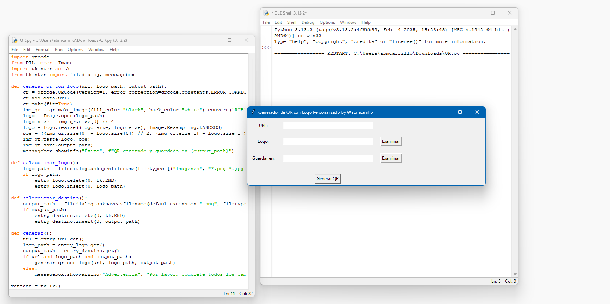

# URL to QR



**URL to QR** es una herramienta open source que te permite generar códigos QR personalizados a partir de una URL, con la opción de agregar un logo en el centro. Es fácil de usar, portable y totalmente gratuito.

## Características
- Genera códigos QR a partir de una URL.
- Permite agregar un logo o imagen en el centro del QR.
- Interfaz gráfica intuitiva.
- Exporta el código QR como archivo PNG.
- Programa portable (no requiere instalación).

## Casos de Uso
- **Personales**: Comparte tus redes sociales, sitios web o información de contacto de manera creativa.
- **Empresariales**: Agrega el logo de tu empresa a códigos QR para promociones, menús digitales o publicidad.
- **Educación**: Crea códigos QR para enlazar recursos educativos o materiales de clase.

## Requisitos
- Python 3.x
- Bibliotecas: `qrcode[pil]`, `pillow`

## Instalación
1. Clona este repositorio:
   ```bash
   git clone https://github.com/tu-usuario/URL-to-QR.git
2. Instala las dependencias:
   ```bash
   pip install -r requirements.txt
3. Ejecuta el programa:
   ```bash
   python src/QR.py
   
## Generar un Ejecutable Portable
Si deseas crear un archivo ejecutable (.exe), sigue estos pasos:
1. Instala PyInstaller:
   ```bash
   pip install pyinstaller
2. Genera el ejecutable:
   ```bash
   pyinstaller --onefile --windowed --name "URL-to-QR" --icon=assets/URL-to-QR.ico src/QR.py
   
## Licencia
Este proyecto está bajo la licencia MIT. Siéntete libre de usarlo, modificarlo y distribuirlo.
Creado con ❤️ por @abmcarrillo.
¡Si te gusta el proyecto, deja una ⭐ en el repositorio!

